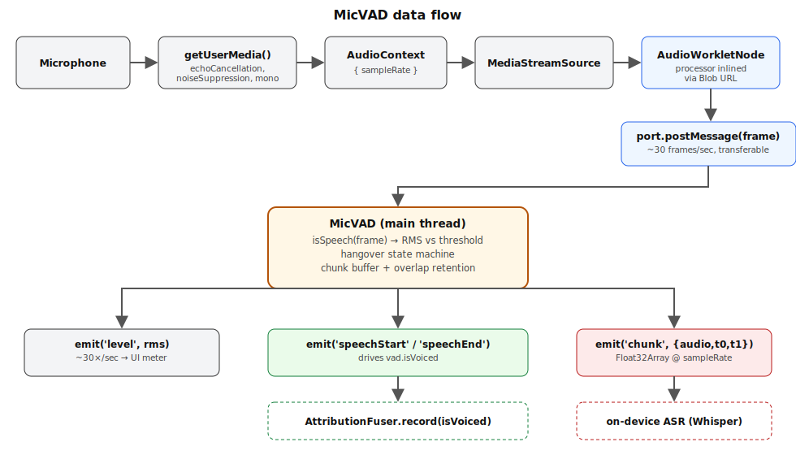
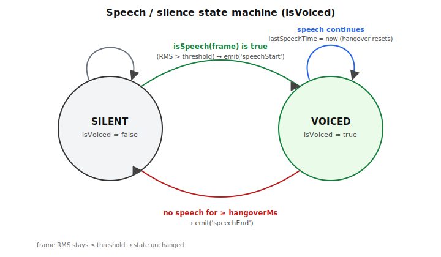
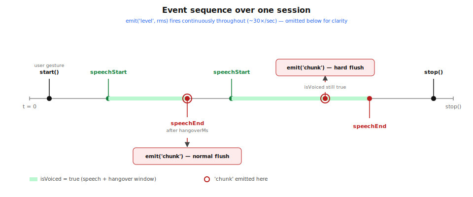
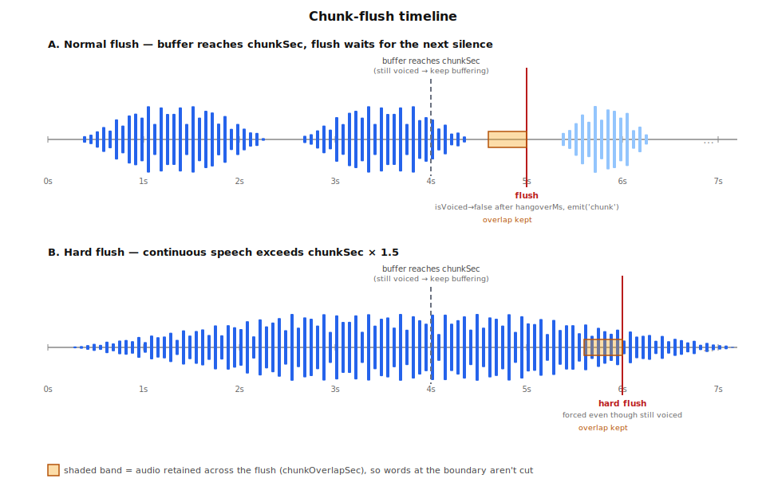
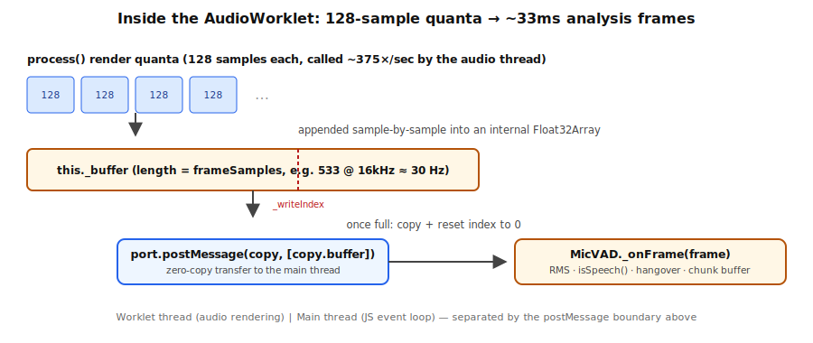

# toolkit-mic-vad

<p align="center">
  
  
  
</p>

Standalone microphone capture + voice activity detection + audio chunking for the browser. Hands Float32 mono audio directly to an on-device ASR (e.g. Whisper via transformers.js). Plain ES module, zero npm dependencies, no build step — just `python3 -m http.server`.



## Usage

```js
import { MicVAD } from './mic-vad.js';

const vad = new MicVAD({
  sampleRate: 16000,
  threshold: 0.012,     // RMS gate for speech
  hangoverMs: 600,       // stay "voiced" this long after energy drops
  chunkSec: 4,           // emit audio chunks of roughly this length
  chunkOverlapSec: 0.4,  // tail kept in buffer after each flush
});

startButton.addEventListener('click', async () => {
  await vad.start();     // must be called from a user gesture — see below
});

vad.on('speechStart', () => {});
vad.on('speechEnd', () => {});
vad.on('chunk', ({ audio, t0, t1 }) => {
  // audio: Float32Array, mono at vad.sampleRate
  // t0/t1: performance.now() ms bounds of the chunk
});
vad.on('level', (rms) => {}); // ~30x/sec, for UI meters

vad.isVoiced; // boolean, live

vad.off('level', handler); // remove a listener
vad.stop();                // releases the mic, closes the AudioContext
```

## API reference

- `new MicVAD(options)` — `sampleRate`, `threshold`, `hangoverMs`, `chunkSec`, `chunkOverlapSec` (all optional, defaults shown above).
- `vad.start()` — async, requests mic permission and begins processing. Idempotent: calling it again while running or starting is a no-op.
- `vad.stop()` — releases the mic and closes the AudioContext. Idempotent: safe to call before `start()` or more than once.
- `vad.isVoiced` — live boolean, true while inside a speech-plus-hangover window.
- `vad.on(event, handler)` / `vad.off(event, handler)` — minimal inline event emitter, no dependencies.
- `vad.isSpeech(frame)` — the speech/silence decision, isolated as a single swappable method (default: RMS vs. `threshold`). Replace it (subclass, or `vad.isSpeech = fn`) to plug in a model-based VAD, e.g. Silero ONNX, without touching any other public API.

### Speech / silence state machine

`isVoiced` is driven by a small state machine: a frame with RMS above `threshold` flips it to `true` and fires `speechStart`; it only flips back to `false` — firing `speechEnd` — once `hangoverMs` has passed with no speech frame. Speech frames continuously reset the hangover clock while voiced.



### Event sequence

A full session looks like this: `start()` → `speechStart`/`speechEnd` pairs as the mic picks up utterances, `chunk` events interleaved either right at a `speechEnd` (normal flush) or mid-utterance if speech runs long (hard flush) → `stop()`. `level` fires continuously underneath all of this at ~30×/sec.



## Chunk-flush behavior

Once the buffered audio reaches `chunkSec`, MicVAD waits for the next moment `isVoiced` goes false and flushes there, so words aren't cut mid-utterance; if speech runs on continuously it hard-flushes anyway at `chunkSec * 1.5` so chunks never grow unbounded. Every flush keeps the last `chunkOverlapSec` of audio buffered for the next chunk, so words spanning a chunk boundary aren't lost.



## Internals: worklet → main thread

The AudioWorklet processor (inlined via Blob URL) accumulates 128-sample render quanta into `frameSamples`-length frames (~30/sec) and hands each one to the main thread as a zero-copy transfer. `MicVAD._onFrame()` on the main thread then does RMS, the `isSpeech()` call, hangover bookkeeping, and chunk buffering — all outside the audio rendering thread, so it's free to be as slow or as fancy (e.g. a Silero ONNX inference) as needed without glitching capture.



## Demo

`demo.html` is the venue-calibration tool for hackathon day: a live RMS meter, a voiced/silent indicator that visibly flips with the hangover delay, a chunk log (duration + t0→t1 per chunk), and a threshold slider that live-updates `vad.threshold`.

```
python3 -m http.server
```

Then open `http://localhost:8000/demo.html` and click **Start**.

**Important:** `vad.start()` must be called from within a real user gesture (e.g. a click handler) — browsers suspend new `AudioContext`s created outside one, and mic permission prompts require it too. `demo.html`'s Start button does this correctly; don't call `start()` on page load.

## Composes with

`'chunk'` feeds an ASR (e.g. Whisper via transformers.js); `isVoiced` feeds `AttributionFuser.record()`.

## Tests

```bash
node --test
```

`start()`/`stop()` need a real browser (getUserMedia, AudioContext,
AudioWorklet) and aren't covered. Everything downstream of a captured
frame is: RMS, the `isSpeech()` threshold gate, the speech/silence state
machine (`_updateVoiced` takes `now` as an explicit argument, so no clock
mocking needed there), and chunk buffering/flush (`_onFrame`/`_flush`,
tested with a tiny fake `performance.now()`) — the flush-at-chunkSec vs.
wait-for-silence vs. hard-flush-at-1.5x logic described above, and
overlap retention across a flush. 14 tests, no dependencies required.

## License

MIT
